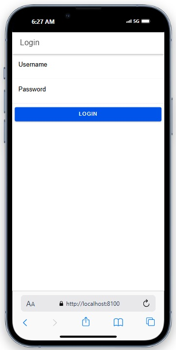
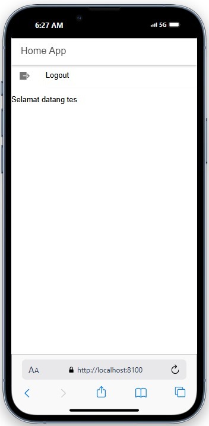

## Screenshots

- **Login Page:**

  

- **Logout Page:**

  

## Cara Kerja Login

1. **Pengguna Memasukkan Kredensial**

- Pengguna membuka halaman login pada aplikasi Ionic dan memasukkan username dan password mereka di form yang telah disediakan.

2. **Kredensial Dikirim ke API**

- Ketika pengguna menekan tombol "Login", aplikasi akan mengirimkan data username dan password tersebut ke server API melalui endpoint login.php yang telah dibuat.

- Pada login.php, password yang dikirimkan akan dienkripsi menggunakan MD5 agar sesuai dengan format yang disimpan dalam database.

3. **Validasi di Server**

- Di server, login.php akan menerima data username dan password, kemudian mencari kecocokan data tersebut pada tabel user di database.

- Jika username dan password ditemukan dalam database, berarti pengguna valid. Jika tidak ditemukan, berarti login gagal.

4. **Mengembalikan Status Login**

a. Jika kredensial valid:

- Server mengembalikan respons JSON dengan status berhasil, beserta username pengguna dan sebuah token unik. Token ini dibuat menggunakan waktu login dan password yang terenkripsi.

b. Jika kredensial tidak valid:

- Server mengembalikan respons JSON dengan status gagal.

5. **Pengelolaan Status Login di Aplikasi Ionic**

a. Di aplikasi Ionic, setelah menerima respons dari server:

- Jika status_login bernilai berhasil, aplikasi akan menyimpan token dan username dalam storage lokal menggunakan modul @capacitor/preferences.
- Status autentikasi pengguna diubah menjadi authenticated (terautentikasi).
- Pengguna kemudian diarahkan ke halaman utama atau dashboard aplikasi.

b. Jika status_login bernilai gagal, aplikasi akan menampilkan pesan bahwa username atau password salah.

6. **Proteksi Halaman dengan Guards**

- Aplikasi menggunakan guards (penjaga) untuk memastikan hanya pengguna yang sudah login dapat mengakses halaman tertentu, seperti halaman utama (home).

- authGuard memastikan bahwa pengguna yang belum login tidak bisa masuk ke halaman utama dan akan diarahkan ke halaman login.

- autoLoginGuard berfungsi untuk mengarahkan pengguna yang sudah login ke halaman utama secara otomatis tanpa harus kembali ke halaman login.

7. **Logout**

- Pengguna dapat logout dari aplikasi melalui halaman utama. Fungsi logout akan menghapus token dan status login dari storage lokal.

- Setelah logout, status autentikasi pengguna diubah menjadi not authenticated (belum terautentikasi), dan pengguna diarahkan kembali ke halaman login.
